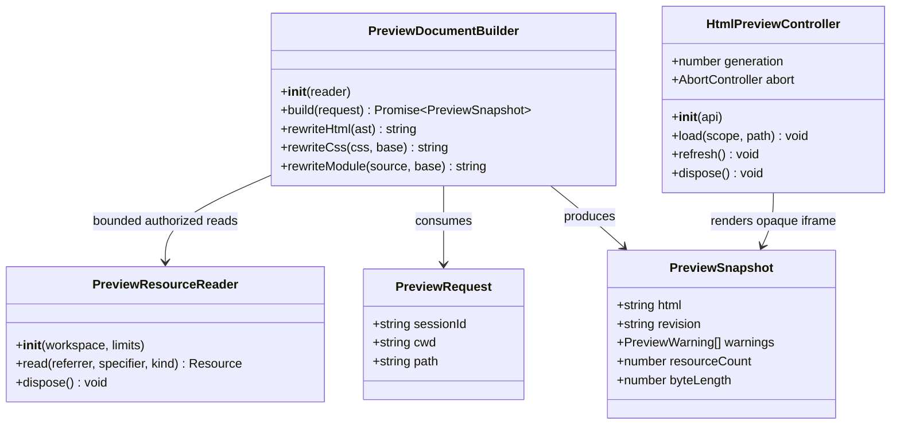
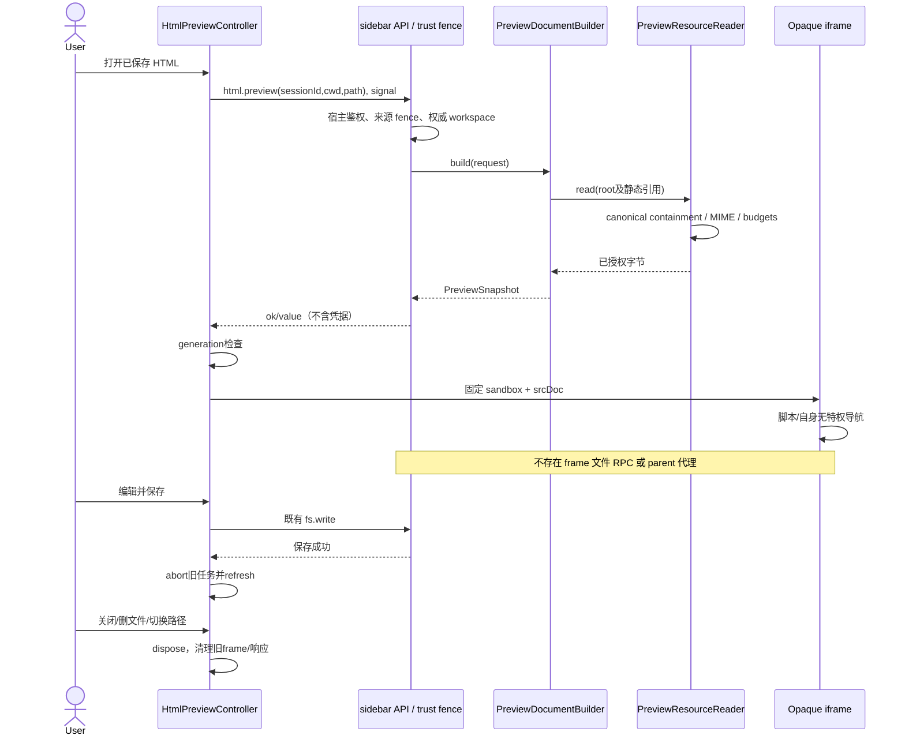
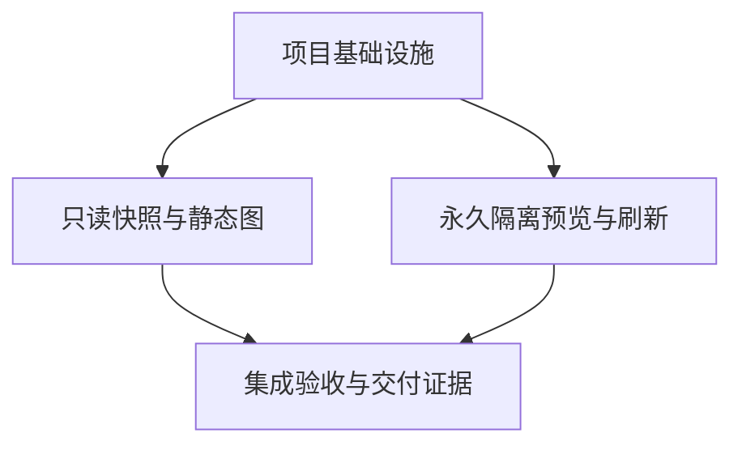

# Issue #1：HTML 预览最小修复与安全验收契约

状态：设计裁定，可继续插件内工程；不是实现通过、Desktop 验收通过或交付完成。日期：2026-09-08。

## 裁定摘要

**选定：受信 GUI 发起一次有界预览快照读取，插件服务端解析已保存 HTML 及静态依赖，返回可直接渲染的 srcDoc；iframe 永久 opaque，不接受任何解锁，不承接文件 RPC。允许 iframe 仅自身的无特权导航，不承诺绝对禁网或绝对禁自导航。**

这一选择保持旧预览的核心宿主隔离边界，并消除 srcDoc 下旧解锁偏好带来的真正提权风险；不是以“导航本来允许”为由无证放松保护。原 route 的 CSP 只有 `sandbox allow-scripts allow-popups allow-downloads allow-modals; object-src 'none'`，没有绝对禁网保证。前期额外提出的禁自导航/禁一切出站不是用户要求，不能作为本 Issue 必须修改官方宿主的理由。

**当前没有已证明不可解的设计阻塞。** 有必须完成的实现和 Electron 安全验收缺口。若真实 Electron 证明 opaque 子 frame 获得 renderer capability，则该发行环境下的红线不满足，立即停交付并上报具体证据；不能靠关闭 fence、开放 ordinary browser 或修改官方 DSH 绕过。缺少此反证时，不预先制造宿主依赖。

## A. 系统设计

### 1. 实现方式与证据边界

#### 1.1 本轮审查面

- 插件本地 HEAD：`6fbfeedc0189e95a1c4d3908d3a58c784c5b7f15`，分支 `fix/issue-1-html-preview`。本轮没有 fetch；这是明确指定的本地工程现场审查，不是远端 PR review。
- 已完整读取 `docs/issue-1-html-preview-engineering.md`（105 行）及根仓 `tmp/sidebar-preview-engineering-report.md`（73 行）。根仓指 sidebar 根仓，不是当前 cwd 的 OmniMux 根仓。
- 工作树原有修改：`.gitignore`、`package.json`、`pnpm-lock.yaml`、`src/index.ts`、`tests/smoke.spec.ts`；本轮不改这些文件。
- 官方发行包只读检查：`/Applications/DSH Desktop.app/Contents/Resources/app.asar.unpacked/lib/`。本轮没有浏览器/Electron 实测，没有修改发行包、启动服务、安装插件或读取实际 capability 值。

#### 1.2 已实测、源码事实和推断必须分开

| 命题 | 证据与结论 |
| --- | --- |
| opaque srcDoc 能运行脚本并发起自身导航 | 工程报告 §32–57 的真实 ego 合成页实测：`event.origin === 'null'`，OOPIF target URL 变化。**本轮复核报告，不是本轮重测。** |
| 外网请求实际成功 | **未证明。** `.invalid` 与拦截保护下的 target URL 变化不是成功外网响应。 |
| 旧 route 允许网络/自身导航 | `src/index.ts:982–1042` CSP、`src/client/html-preview.ts:15` sandbox 源码；没有对应绝对禁网策略。 |
| 子 frame 请求自动得到 Desktop header | 不能仅按目标 URL 判定；发行 `electron-runtime-DLNj0vyk.js:592–638` 明确同时检查 webContents、目标 origin、来源 frame 实际 origin 及其 top origin。 |
| 自导航到 GUI 后永久 opaque | HTML sandbox 规范推断；需要目标 Electron 的导航/重定向/OOPIF 实测锁定。不是现有工程实测结论。 |
| 用户原始失败 iframe 已被复现或修复 | **未完成。** 普通浏览器打开 43120 得到 forbidden 不能代替原始预览调用链证据。 |

#### 1.3 Electron capability 的具体裁定

发行版 `installRendererAccessHeader` 先移除请求中所有同名 `x-dsh-desktop-renderer` header，再仅在以下条件满足时注入：

1. `requestBelongsToRenderer`：请求确属当前 renderer webContents；
2. 目标 origin 是 GUI HTTP origin 或配对 WebSocket origin；
3. `requestComesFromRendererOrigin`：仅 `resourceType === 'mainFrame'` 特判通过；其他请求要求 `details.frame` 存在、未 detached、`frame.origin === GUI origin`，且 top 的 origin 也等于 GUI origin。

**子 frame 导航仍是 `subFrame`，不是 `mainFrame`。URL 变成 GUI 地址不使其升级为主 frame。** iframe 属性始终没有 `allow-same-origin` 时，浏览器计算新文档 origin 应仍为 opaque；所以来源 frame 的实际 origin 不等于 GUI，后续 GUI HTTP/WS 请求也应不携带 capability。frame 缺失/分离在当前代码中拒绝而非放行。跨 origin 重定向请求仍须重新经过上述过滤。

`desktop-browser-access-5-Ph3Uv7.js:47–50`：正确 native header 才分类为 renderer；ordinary browser 关闭时其余请求 denied。查询参数不能替代该 header。`electron-runtime-DLNj0vyk.js:812–850` 的导航阻断仅处理主 frame，明确不是子 frame 禁导航策略。

主窗口 `baseWindowOptions`（同文件 348–365）启用 `contextIsolation: true`、`nodeIntegration: false`、`sandbox: true`、`webSecurity: true`，使用持久 renderer partition。**主窗口没有显式声明 `nodeIntegrationInSubFrames: false`，不得把辅助窗口中的显式设置冒充主窗口证据。** 这里依赖 Electron 默认值及运行时验收。`preload.cjs:1–9` 只暴露真实 Web File 的路径解析桥，未暴露 renderer token；仍须实测子 frame 无此 bridge、无 Node/IPC，不仅检查 token 字符串。

**残余不确定性：** 实际 Electron 对 `webRequest.details.frame.origin` 在导航提交前后、redirect、OOPIF 中的实现值尚未采样；磁盘发行源码也不等于已运行 bundle hash。应做 QA 门禁，不应凭源码宣称已经实测安全。

#### 1.4 浏览器边界

- `sandbox` 属于父文档中的 iframe 元素；脚本只能改自己的 DOM，不能触及跨 origin 的 `parent.document` 或 `frameElement` 并撤掉属性。
- 同一 iframe 后续导航的新文档继续受其 iframe sandbox flags 约束；这是浏览器算法，不依赖最初 srcDoc 的 CSP。子孙 frame 还继承祖先 sandbox 限制。
- **最初文档的 meta CSP 不是跨导航永久策略。** 不以 `navigate-to 'none'`、`connect-src 'none'`、删除 refresh 或 patch `location` 宣称禁自导航/禁出站。CSP `sandbox` 不可用 meta 充当永久边界。
- opaque 阻止获得 GUI origin 的 DOM、localStorage、IndexedDB、cookie 读取和 same-origin API 权限；但不意味着浏览器绝不发送任何 cookie、请求或已加载文档字节。跨源 SOP 也不是通用 CSRF 防线，保留服务端来源 fence 和 Desktop capability gate。
- `allow=""` 不是所有 Permissions Policy 功能的总禁令；没有额外 feature delegation，必要时显式拒绝 camera/microphone/geolocation 等，但不把该属性当 capability 防线。
- 自身导航可以把**预览已经获准包含的内容**编码进 URL；本契约不保证恶意 HTML 无法外传自己的内容。不向预览加入宿主凭据、配置、cookie、token、父页面 URL 查询串或隐藏会话数据。若被预览文件本身含用户秘密，不可能在同时允许任意脚本/网络的条件下保证秘密不被其脚本外传；这不是自动提升文件读取授权的理由。

规范参考（说明语义，不替代发行版实测）：[HTML iframe sandbox](https://html.spec.whatwg.org/multipage/iframe-embed-object.html#attr-iframe-sandbox)、[HTML sandboxing](https://html.spec.whatwg.org/multipage/browsers.html#sandboxing)、[Electron WebRequest](https://github.com/electron/electron/blob/main/docs/api/web-request.md)、[WebFrameMain](https://www.electronjs.org/docs/latest/api/web-frame-main)。

#### 1.5 备选比较

| 方案 | 结论 |
| --- | --- |
| 永久 opaque srcDoc + 有界静态快照 | **采用。** 绕开不受信子 frame 无法鉴权读取本地资源的问题，主 GUI 是唯一发起者，不修改官方宿主。 |
| 给 iframe 同源/凭据，或关闭来源 fence | 拒绝，直接违反用户红线。 |
| 原 route 原样继续使用 | 不解决正式 Desktop forbidden，MIME 修复只能作为配套。 |
| 无脚本预览或全面离线渲染器 | 不等价于现有交互 HTML；用户未要求，不作为默认降级。 |
| 通用 bundler、网络代理、宿主拦截器 | 不属于最小修复；本方案不需要。 |

### 2. 文件与功能边界

以下是实现建议文件清单；可按仓内命名习惯合并纯 helper，不扩成通用资源平台。

- 基础设施与入口：`package.json`、`pnpm-lock.yaml`、`src/index.ts`。
- 有界预览数据层：`src/html-preview-resource.ts`、`src/html-preview-document.ts`、`src/html-preview-types.ts`。
- 复用安全模块（不放宽）：`src/path-security.ts`、`src/trust-fence.ts`、`src/wire.ts`。
- 客户端集成：`src/client/api.ts`、`src/client/HtmlPreview.tsx`、`src/client/html-preview.ts`、`src/client/TextEditor.tsx`、`src/client/changes/DiffPane.tsx`。
- 偏好与说明：`src/client/builtins/viewers.tsx`、`src/client/locales.ts`、`src/client/locales-ja.ts`、`docs/external-plugin-guide.md`；其他 locale 利用既有 fallback 或同步，不留下能解锁 HTML 的可用控件。
- 测试与证据：`tests/html-preview-resource.spec.ts`、`tests/html-preview-document.spec.ts`、`tests/html-preview.spec.tsx`、`tests/smoke.spec.ts`、`docs/issue-1-html-preview-engineering.md`、`docs/issue-1-preview-security-design.md`。

#### 2.1 唯一新 API

复用现有 `/sidebar/api` dispatch、会话解析、响应 envelope 和 trust fence，增加 `html.preview`：

- 输入 `{sessionId: string, cwd?: string, path: string}`，`cwd` 只走现有权威 session 解析，不允许指定任意新的根目录。不接收 URL、headers、cookie、任意资源路径列表或任意文件读取命令。
- 输出 `{html: string, revision: string, warnings: PreviewWarning[], resourceCount: number, byteLength: number}`，继续外包 `{ok:true,value}`；失败沿用 `{ok:false,error:{code,message}}`。不得把 raw headers/token/debug 环境对象串入结果。
- `revision` 由根文件及读取到的依赖内容摘要形成；仅用于刷新/旧结果比较，不是 bearer ticket。无新持久状态，无后续资源端点，无 capability URL。
- 根 HTML 与依赖全部在一次服务端受控快照构造内读取。不要在 GUI DOM 上解析不受信 HTML 后遍历 `.src`：惯性资源加载可产生带宿主权限的请求。优选 Node 上纯 parser，无 JS 执行/无网络；父页面只持有最终字符串并赋予 sandbox srcDoc。

#### 2.2 资源授权和规模

- 权限上界是**会话 workspace canonical root**，不是 HTML 所在目录；`../shared/style.css` 在同一 workspace 内应成功。每一个依赖以引用文件自身目录解析；不是一律相对根 HTML。
- 新预览调用 `ensureWorkspacePath(cwd, target, true)`，不能受 `workspaceFence=false` 影响。旧 route 的 trust fence/CSP 不动；不把旧 API 的可关闭 fence 带入新预览。
- 仅从 parser 识别的静态语法提取依赖；无目录扫描、运行时 `postMessage` read、XHR interception、本地 fetch shim 或 frame 传入路径。跨 workspace、symlink 逃逸、NUL、非文件、设备/FIFO、未知 MIME 拒绝。错误显示于受信父 UI，不将绝对环境诊断灌进 frame。
- 明确允许 HTML root、CSS、JS/MJS、图片/SVG、字体和已有媒体 MIME；任意 `.env`/凭据/JSON 配置不因被写成 `url()` 就获得授权。扩展名/MIME 校验不是秘密检测器；不承诺辨认 `.js` 中人为放入的秘密。
- 建议硬预算：根不超过既有 readLimit，单资源不超过既有 mediaLimit，总输入/输出各不超过 16 MiB、最多 128 个 unique 本地资源、递归深度 16、并发最多 4，实际取与既有更小限制的交集。这些是待实现常量，不声称当前已存在。
- 读前 stat、实际读取计数及读后校验；避免整文件无限 read 后才限长。canonical 路径读取要处理 symlink/替换竞争，拒绝不稳定快照；不能把单次 realpath 宣称消灭全部 TOCTOU。预算、取消、循环均有可辨认错误，不返回悄悄截断的可执行 HTML。

#### 2.3 静态兼容，不做通用 bundler

- 使用 HTML AST parser（推荐 `parse5`）与已准备 `css-tree`，不以正则重写完整 HTML/CSS。
- 本地 `<link rel=stylesheet>`、CSS `@import` / `url()`、`src` / `srcset`、经典 script、字体、图像转换为正确 MIME 的 data URL 或等价安全内联；CSS 中 URL 相对各自 CSS 文件解析。保留 media/layer/supports 语义、经典脚本执行顺序以及 async/defer 语义。SRI 不可在改变字节后原样误用或静默删除：验证原始资源或明确报不支持。
- SVG `url(#id)`、`href="#id"` 保持原样；外部 SVG `file.svg#id` 重写资源后保留 fragment，query 不能绕过 canonical 路径/预算。CSS import 循环做显式诊断或符合浏览器忽略循环的语义，不能挂死。
- 保留无特权 HTTP(S) 远程 script、stylesheet、image、font、module 和 fetch/WS 的浏览器原生行为；不通过服务端或 GUI 替其联网、不转发认证信息，不因前期禁网假设一律删除远程资源。保留远程 URL 的 CORS/SRI/referrer 等语义，不自动加 credentials。远程代码只能在 opaque frame 中执行。
- 本地 module **不能假装把 `.mjs` 变成 data URL 就完整支持**：相对 import 会失去基址。用现成 `es-module-lexer` 对静态 import/export 和字符串字面量 dynamic import 做有界图发现与 specifier 重写；无依赖 inline module、远程模块及其浏览器原生依赖直接保留。本地无环模块图可底向上编码为 data module，统一 canonical 模块 identity 避免重复实例。
- import map：解析 JSON 并保留远程映射，按原文档基址规范化 scopes 与本地映射后参与同一资源图；不擅自删除。若本地循环模块、非字面量动态 import、运行时依赖 `import.meta.url` 的相对本地加载或复杂 import-map 场景无法语义保持，应显式提示具体不支持的引用并保留编辑入口，不能默默输出“成功预览”。不新增 TS/JSX 编译、npm 解析、HMR、服务 worker 或运行时任意文件桥。
- 为防止把兼容欠项包装成安全限制，QA 必须分别列出原版可工作样本、原版受 opaque/CORS/forbidden 限制的样本、候选新失败样本。对原版确实可工作的必需模块场景，优先在此有界序列化层修复；不能用一句“模块不支持”结案。当前没有证据要求通用 bundler。
- 清除/规范化影响基址的 `<base>`：先在 AST 中按原文档语义解析资源引用，再移除，不能先删后错误解析。`base-uri 'none'` 作为初始文档防御。片内锚点保留；自身链接/refresh 不必为本 Issue 一律禁止，但不提供父导航代理。禁止 object/embed，与旧 CSP 一致。

#### 2.4 iframe 与保存刷新

- 共用 `HtmlPreview` 于 TextEditor 与 DiffPane，初次创建就带固定 sandbox；不得先无 sandbox 挂载再 effect 修补。
- 建议沿用旧 `allow-scripts allow-popups allow-downloads allow-modals`，**永不**加入 `allow-same-origin`、`allow-top-navigation*`、`allow-forms`、`allow-popups-to-escape-sandbox`。保留原 token 避免无关兼容回退；不新添权限。旧 popups 允许并不等于任意顶层特权窗口，Electron 现有 handler 返回 deny 并可能外部打开 HTTP(S)/mailto，须作为既有行为单独验收，不宣称所有 popup 行为被禁止。
- HTML 的 `htmlViewerNoSandbox` / `htmlViewerDefaultUnsafe` 旧持久值即使 true 也不能影响新 frame。移除 HTML 解锁按钮和相关设置入口；不顺手改 BrowserView 的独立浏览器策略。
- `referrerPolicy="no-referrer"`；srcDoc 内前置 `<meta name="referrer" content="no-referrer">` 和 CSP `object-src 'none'; base-uri 'none'`，保留用户自身更严格 CSP。不额外添加全面 `default-src 'none'`/`connect-src 'none'` 使网络/模块无意退化。宿主 CSP 可能对 srcDoc 产生继承限制，须记录实测，不能靠修改官方 CSP 解决。
- 不监听 frame 的文件请求、不回复任何 parent state。若已有全局 message listener，审计其 source/origin/nonce 校验，不能把 `origin === 'null'` 当可信。新功能不增加 message listener 最简单。
- 预览只显示保存内容，不使用 unsaved editor draft。保存成功递增刷新 generation，切换路径/session/模式及卸载 abort；旧响应不能盖住新路径。失败/截断显示父 UI 错误，不退回不安全 src 或解锁模式。更新/删除行为均通过既有编辑 API，预览服务只读。

### 3. 数据结构与接口

以下为逻辑接口；已有 TypeScript 函数可以实现这些职责，不强制改成 class。

### 4. 调用流

### 5. 不明确项与真正的停止条件

本轮未拿到用户原始失败 iframe 的 Electron 网络轨迹，未验证宿主 CSP 对 srcDoc 模块的实际限制，未运行模块兼容样本。工程应继续实现，QA 补证；这不是需用户替工程决定的权限问题。

停止交付的具体条件：opaque frame 实际取得 capability/IPC、能读 parent storage、路径读逃逸、模块/样本出现未经说明的实质回退。先在插件权限范围修复；若只能改官方宿主才能保持已授权红线，才由主理人记录真实跨仓依赖/权限缺口。**目前没有需要用户作出的新增权限决定。** 禁网并未获用户要求；给予同源、凭据、关闭来源 fence 则与本次红线相反，不作为待选捷径。

## B. 实施分解与验收

### 6. 所需依赖

沿用 React 18、TypeScript、现有 tsdown/Vitest 与 API 层，不引入 MUI/Tailwind/Vite/Python；现有技术栈已确定。

- `css-tree@3.2.1`、`@types/css-tree@2.3.11`：已有工程准备；以实际类型检查确认匹配。
- `parse5@8.0.1`：锁文件已有间接依赖，正式使用需在 package.json 声明直接依赖，纯 HTML AST 不运行页面。
- `es-module-lexer@2.3.2`：锁文件已有间接依赖；有界 module specifier 分析，正式使用需直接声明。
- 不引入整个 bundler 或联网解析器；间接依赖存在不代表可不声明直接引用。

### 7. 按依赖排序的任务（4 项）

| ID | 任务名 | 文件（创建或修改/验证） | 依赖 | 优先级 |
| --- | --- | --- | --- | --- |
| T01 | 项目基础设施 | package.json、pnpm-lock.yaml、src/index.ts：依赖声明、现有入口新增方法、保留 MIME 修复；其他配置不分散新建 | 无 | P0 |
| T02 | 只读快照与静态图 | src/html-preview-resource.ts、src/html-preview-document.ts、src/html-preview-types.ts、tests/html-preview-resource.spec.ts、tests/html-preview-document.spec.ts | T01 | P0 |
| T03 | 永久隔离预览与刷新 | src/client/api.ts、src/client/HtmlPreview.tsx、src/client/html-preview.ts、src/client/TextEditor.tsx、src/client/changes/DiffPane.tsx、src/client/builtins/viewers.tsx、src/client/locales.ts、src/client/locales-ja.ts、tests/html-preview.spec.tsx | T01；先按契约独立开发 | P0 |
| T04 | 集成验收与交付证据 | tests/smoke.spec.ts、tests/html-preview.spec.tsx、docs/external-plugin-guide.md、docs/issue-1-html-preview-engineering.md、docs/issue-1-preview-security-design.md | T02、T03 | P0 |

### 8. 共享知识与验收契约

API envelope 必须复用仓库 `{ok,value}` / `{ok:false,error}`，不要按通用模板改为 `{code,data,message}`。所有状态只属于本次预览，不持久化 capability，不缓存跨 session 资源授权。

#### 8.1 安全必过

| 编号 | 验证 | 通过定义 |
| --- | --- | --- |
| S1 | HTML 两入口、旧 unsafe prefs 四组合、重载/刷新/路径切换 | iframe 每次创建和导航后 sandbox 存在，无 allow-same-origin / top-navigation / escape-sandbox；解锁控件不可操作 |
| S2 | inline JS、location.replace 到无害 GUI 路径、HTTP重定向、about:blank/data/远程回 GUI、OOPIF | 子 frame 有效 origin 保持 opaque；parent.document、parent.localStorage/cookie 不可读；不要拿 location.origin 代替 security origin |
| S3 | 正式 Electron GUI 与子 frame 的受保护 HTTP/WS | 主 GUI 读取成功；子 frame 不被分类 renderer，无 capability；只记录 header存在布尔/状态，禁止记录 token值或敏感响应体 |
| S4 | preload/桥与消息探测 | frame 无 require/process/IPC/桌面文件桥可用能力；伪造 message 不产生任何主 GUI 文件读取/导航/命令执行 |
| S5 | 路径与静态授权 | workspace 内 ../shared 成功；外部/符号链接逃逸/编码绕过/非文件/未知 MIME/超预算拒绝；workspaceFence=false 也不改变新预览边界 |
| S6 | 父层解析隔离 | 恶意 img、script、base、SVG、CSS、module 在构造快照时不会在 GUI 发起任何未经授权网络请求或执行；服务端不发远程请求 |
| S7 | 导航/联网语义 | 自导航出现不判失败；顶层 GUI 导航不发生、敏感 API不可用。允许固定无敏感标记的受控联网探针验证行为；不以URL变化证明联网成功 |
| S8 | 凭据与已授权内容边界 | 快照不包含宿主token/cookie/headers/环境配置；外部资源请求不获 native header，不使用 GUI/服务端 credential proxy |

Electron S2/S3 必须覆盖初次 subframe navigation、提交后 fetch、重定向以及 process swap。请求被 CSP 拦住只证明该路径未到服务器，不能独立证明 capability injector 正确。应组合正式 renderer 中的合成 opaque frame（Electron-only CDP 平台补充）与实际插件预览行为；不修改官方代码，也不向恶意脚本交付凭据。若需要测 header，仅使用脱敏诊断或测试端状态，不 dump HAR 秘密。

#### 8.2 功能必过

- 用户原始样本保持磁盘不变，通过实际侧栏打开，初始交互、内联 SVG 渐变/fragment、样式与脚本成功；记录原失败与候选成功证据。
- 相对 classic JS/CSS/image/font、嵌套 CSS import、workspace 内 ../shared、srcset、带 fragment SVG；MIME 正确且不是 octet-stream。
- inline module、本地无环 module import/export、字面量 dynamic import、远程 module/CORS、import-map 远程映射；复杂本地图给显式支持/限制结果，不删除脚本假通过。
- 远程 CSS/script/image、浏览器原生 fetch/WS 不被新增“绝对禁网”策略意外杀死。测试使用无用户内容的受控资源；不要求外部所有站点都可用。
- 根或资源截断/删除/无权限/超预算/循环有父 UI 提示；loading→error 不保留错误路径旧画面；保存成功刷新、保存失败不刷新成未保存版本；取消/切换路径与慢请求竞争正确。
- TextEditor 与 DiffPane 都用同一隔离面；独立 BrowserView 不回归。

#### 8.3 证据、交付、关闭

1. 工程运行 `pnpm typecheck`、`pnpm build`、完整 `pnpm test`、修改文件 eslint、`git diff --check`；先 build 再 test，沿用报告中的 command-local Git 测试身份，避免伪失败。旧 1316 pass 不是新方案证据。
2. 实际 UI 验收使用 ego-browser；正式 Desktop 独有能力以 Electron-only CDP 补充。普通浏览器 43120 的 forbidden 是环境事实，不准关闭 ordinary-browser gate 为了取截图，也不能替代原始 iframe 的成功证据。若 ego 无法进入受信目标，清楚标 UI 证据受阻，继续能够完成的 Electron 平台取证，不冒充 UI 已通过。
3. 主理人负责独立 QA、fork PR review/merge、从 merged commit 打包、正规 CLI 安装正式 `desktop` profile、验证实际激活版本和 App 预览。安装路径/命令以实际 packaged CLI help 与当前 profile 为准，不复制 node_modules、不打官方补丁，不另启 GUI 冒充更新。
4. 代码通过、PR合并、profile安装、正式运行时通过分别报告；只有用户原始 forbidden 消失、上述红线证据成立且无未说明回退，才可关闭 Issue #1。无本轮提交/合并/安装授权执行，本文件仅设计交付。

### 9. 依赖图

